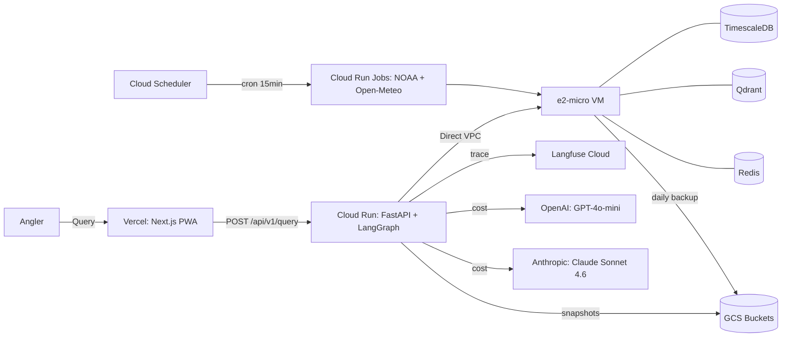

# Tide — Hyper-local NJ Saltwater Fishing Intelligence

> A single natural-language query returns a specific, cited, condition-aware
> fishing recommendation (spot + time window + confidence) that an angler would
> otherwise spend 30–60 minutes synthesizing across 5+ separate tools.

[](https://github.com/X-commando/tide/actions/workflows/ci.yml)
[](https://github.com/X-commando/tide/actions/workflows/ragas.yml)
[](https://github.com/X-commando/tide/actions/workflows/build-push.yml)
[](https://github.com/X-commando/tide/actions/workflows/frontend-ci.yml)
[](https://github.com/X-commando/tide/actions/workflows/deploy-prod.yml)

## Live demo

- **PWA (Vercel):** <https://tide-six.vercel.app>
- **Backend (Cloud Run):** _to be filled by deploy step (see `terraform output backend_url`)_
- **Sample Langfuse traces** (publicly viewable, no account required):
  - Happy path (striper): <https://us.cloud.langfuse.com/project/cmon6k8aa015mad07jxqayowr/traces/cdaa58b7e3d0207b8e15660a404df7c0>
  - Out-of-scope ("trout in Colorado"): <https://us.cloud.langfuse.com/project/cmon6k8aa015mad07jxqayowr/traces/10ea29e31ceb10550cf6f5b0ef6ffd4c>
  - Cache hit candidate: <https://us.cloud.langfuse.com/project/cmon6k8aa015mad07jxqayowr/traces/75147a4438b155204c34cd5d92e200b4>
  - Partial conditions: <https://us.cloud.langfuse.com/project/cmon6k8aa015mad07jxqayowr/traces/c2fdd862bfab4d58fee6c8900bd0d30b>

## Architecture



Single-region (us-east1) deployment on GCP Always-Free. Total monthly cost
target: **$0 + LLM spend (capped at $30/mo)**. The e2-micro VM hosts TimescaleDB
(the Cloud SQL trap — Cloud SQL doesn't support the TimescaleDB extension),
Qdrant for vector RAG, and Redis. Cloud Run reaches the VM over **Direct VPC
Egress** (no `google_vpc_access_connector` — saves $25/mo).

## How it works (plain language)

### 1. Data foundation (Phase 1–2)

Every 15 minutes a Cloud Run Job polls NOAA's 9 NJ stations for tide / water
temp / wind / wave height; a second job polls Open-Meteo for forecast data and
a third computes solunar windows from `ephem`. All flows into a TimescaleDB
hypertable on the e2-micro VM (~156K rows × 4 tables, 181 days of history at
the time of launch). A separate corpus of **547 NJ saltwater fishing reports**
lives in Qdrant, embedded with OpenAI `text-embedding-3-small` and queryable
via hybrid BM25 + dense RRF.

### 2. Per-species activity ML (Phase 2)

For 5 NJ species (striper, fluke, bluefish, weakfish, tautog) a per-species
XGBoost classifier predicts an "active fishing window" probability from the
current + forecast conditions. Each spot gets a 24-hour score timeline. SHAP
values surface the top 3 contributing features per prediction. Quality bar:
AUC-ROC ≥ 0.72 on a **temporal-holdout** test set (no chronological leakage);
Brier ≤ 0.22. At MVP, the corpus side closed (547 ≥ 500 records, R-01); the
ML promotion gates (M-08 / M-09) remain open and are gated on hand-labeling
in v1.x.

### 3. RAG corpus (Phase 2)

547 structured reports from authorized forums (StripersOnline + NJ Fishing +
manual FB transcription with full attribution per L-07 amendment). Each
report is chunked with metadata (species, location, condition tags), embedded,
and indexed in Qdrant for hybrid retrieval with freshness-prioritized scoring.

### 4. LangGraph agent (Phase 3)

4-node graph traced end-to-end in Langfuse:

```
Planner (GPT-4o-mini, intent + spots-of-interest, 5s timeout)
  → Data Fetcher (ML scores + condition snapshot from TimescaleDB)
  → RAG Retriever (hybrid search against Qdrant; freshness-prioritized)
  → Synthesizer (Claude Sonnet 4.6, cited recommendation as SSE)
```

Every node span, every chunk score, every token cost is captured in Langfuse.
Critic node and cross-encoder reranker are deferred to v1.x.

### 5. Frontend (Phase 4)

Next.js 16.2.4 + React 19.2 + Tailwind v4 + shadcn/ui + MapLibre GL JS v5.24.0
+ OpenFreeMap PWA. 5 routes, SSE streaming via `eventsource-parser`,
Lighthouse-gated LCP ≤ 3s, axe-core-clean WCAG 2.1 AA. Mapbox was dropped
during Phase 4 (required credit card on 2026 signup); MapLibre + OpenFreeMap
is the open-source replacement.

### 6. Eval + LLMOps (Phase 5)

20-question Ragas golden dataset (4 hand-graded + 16 placeholder) +
faithfulness / relevancy / context-precision / context-recall **delta gates**
in CI — any single metric dropping by Δ > 0.05 from baseline fails the build.
4 public Langfuse showcase traces are pinned (see "Live demo" above). The
5th rate-limit trace is deferred to v1.x (slowapi short-circuits before the
Langfuse callback fires).

### 7. Infrastructure (Phase 6)

Terraform-managed end-to-end (no `google_vpc_access_connector`, no Cloud SQL
— both architecturally forbidden). Cloud Run with **Direct VPC Egress**,
scale-to-zero, SSE keepalive every 10s (Cloud Run's 60s idle timeout would
otherwise close streams). **Workload Identity Federation** for GitHub Actions
(no JSON service-account keys). 6 secrets in Secret Manager. CSP headers,
rate limit 20/IP/hr, prompt-injection defense via XML-wrapping of RAG chunks.

## Tech stack

| Layer          | Tech                                                                            | Why                                       |
| -------------- | ------------------------------------------------------------------------------- | ----------------------------------------- |
| Frontend       | Next.js 16.2.4 + React 19.2 + Tailwind v4 + shadcn/ui                          | PWA + RSC + streaming                     |
| Map            | MapLibre GL JS v5.24.0 + OpenFreeMap                                            | open-source, no credit card needed        |
| Backend        | FastAPI + uvicorn + sse-starlette                                               | async + SSE                               |
| Agent          | LangGraph 1.1.8 + LangChain                                                     | 4-node graph, streaming                   |
| ML             | XGBoost 3.2.0 + SHAP 0.51.0 + MLflow                                            | tabular + interpretable                   |
| RAG            | Qdrant 1.x + OpenAI embeddings + hybrid BM25/dense RRF                          | NJ-jargon-tuned                           |
| Data           | PostgreSQL 17 + TimescaleDB 2.x                                                 | hypertables; Cloud SQL trap → VM          |
| Queue          | Celery 5.6.3 + Redis 7 broker                                                   | no Kafka                                  |
| Observability  | Langfuse v4.3.1 + Prometheus                                                    | LangGraph-aware tracing                   |
| Eval           | Ragas 0.4.3 + GPT-4o evaluator                                                  | live-HTTP, delta-gated CI                 |
| Infra          | Terraform + GCP Cloud Run + Compute Engine e2-micro + Direct VPC Egress         | $0/mo Always-Free target                  |
| CI/CD          | GitHub Actions + Workload Identity Federation (no JSON keys)                    | Pitfall P6                                |

## Quickstart (local dev)

```bash
# Frontend
cd frontend && npm install && npm run dev

# Backend
cd backend && uv sync && uv run uvicorn app.main:app --reload

# Local docker-compose (TimescaleDB + Qdrant + Redis + Celery worker + beat)
docker compose up -d
```

## Deploy from scratch

Pre-reqs: `gcloud`, `terraform >= 1.6`, Docker. See
[`scripts/gcp_bootstrap.sh`](scripts/gcp_bootstrap.sh) for the GCP project +
billing setup, and
[`.planning/phases/06-infrastructure-launch/06-READY-TO-DEPLOY.md`](.planning/phases/06-infrastructure-launch/06-READY-TO-DEPLOY.md)
for the full launch handoff (11 numbered steps from clean GCP fork → tagged
release).

```bash
./scripts/gcp_bootstrap.sh
cd terraform && terraform init && terraform apply -var-file=staging.tfvars
```

## Local Dev: MLflow UI

Per-species training runs (XGBoost activity model) are tracked in
`backend/mlruns/`. To browse run history, AUC-ROC, Brier score, and SHAP
feature-importance plots locally:

```bash
cd backend
uv run mlflow ui --backend-store-uri file://$PWD/mlruns --port 5000
```

Then open <http://localhost:5000> → select experiment `tide-activity-model`
→ group by `params.species` for the 5 MVP species (striper, fluke,
bluefish, weakfish, tautog). Promotion status reflects D-04 (M-08 / M-09
gates lock as-is): **0 / 5 species are currently promoted to the MLflow
`production` alias** because no run has cleared AUC-ROC ≥ 0.72 AND Brier
≤ 0.22 on the temporal-holdout test set. See `data/model_registry_report.json`
for the per-species promotion attempt log; the corpus uplift to clear the
gate is Phase 6 pre-launch QA work, not a Phase 5 regression. The pipeline
(train → evaluate → register → gate → promote) is fully wired in
`backend/scripts/promote_production.py`.

## Monitoring + Metrics

The FastAPI backend exposes Prometheus `/metrics` with bounded-cardinality
counters and gauges (no path-templated labels per Pitfall P4):

- `query_cache_hits_total` / `query_cache_misses_total` — query-cache effectiveness (P-09)
- `data_age_seconds{station_id, source}` — freshness signal per NOAA station
- `ingest_success_total` / `ingest_failure_total` — Celery ingest task health
- `freshness_gate_503_total{station_id, reason}` — `/conditions` 503 events

### Cache hit rate (P-09 target ≥ 40%)

`/metrics` does NOT expose a pre-computed gauge — operators compute it from
the canonical Prometheus pattern (counters in-process; rates in PromQL):

```promql
rate(query_cache_hits_total[15m])
  /
(rate(query_cache_hits_total[15m]) + rate(query_cache_misses_total[15m]))
```

This pattern lets the operator change the rolling window without redeploying.
(Pre-computed ratios silently lie when one of the rates is zero; the PromQL
`rate()` form handles the zero-divisor case at scrape time.)

### Readiness: `/healthz` (REL-01)

Also served at `/api/v1/healthz` — Cloud Run's Google frontend intercepts the
bare `/healthz` path with a 404, so deployed probes and smoke tests use the
`/api/v1` alias.

```json
{
  "ts_lag_seconds": 142,
  "qdrant_ok": true,
  "model_loaded": true,
  "status": "ok"
}
```

Returns HTTP 200 when `status == "ok"`, HTTP 503 when `status == "degraded"`.
Always served with `Cache-Control: no-store` to prevent CDN cache poisoning
of stale `degraded` responses (Pitfall P3).

## Further reading

The project planning artifacts (decisions, roadmap, requirements, per-phase
plans + summaries) live in a `.planning/` directory that is gitignored —
they are kept local to the working copy and not published with the public
source. Build and runtime behavior is fully captured by the code in this
repository.

## License

See [`LICENSE`](LICENSE).
